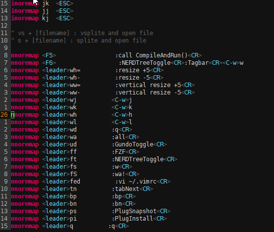

# linvim

## a light vim config with easy hotkeys,running fast

* only test in linux (my env is linux mint);

* How to install:
1. git clone https://github.com/lilin5819/linvim && bash linvim/install.sh
2. :PulgInstall                 (in vim)

# Thanks
